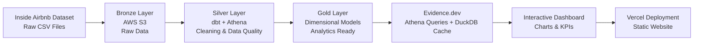

# 🏡 Airbnb Analytics Platform

### Data Lakehouse + dbt + Athena + Evidence.dev + Vercel

An end-to-end analytics platform that transforms Airbnb listings into a modern data warehouse and interactive dashboard using AWS, dbt, and BI-as-code.


## Demo


---

## About

This project builds a complete analytics pipeline for Airbnb listings in São Paulo.

Raw datasets are stored in Amazon S3, transformed with dbt following the Medallion Architecture, queried through Amazon Athena, and visualized using Evidence.dev. The final dashboard is deployed as a static website on Vercel.

---

## Motivation

Understanding Airbnb pricing trends requires more than simply querying raw CSV files.

This project demonstrates how modern Data Engineering practices can be applied to build a scalable analytics platform by combining:

- Medallion Architecture
- Dimensional Modeling
- Data Quality with dbt
- Serverless Analytics with Athena
- BI-as-Code with Evidence.dev

The final result is an interactive dashboard capable of exploring prices, neighborhoods, and review scores with low latency and minimal cloud costs.

---

## Features

- End-to-end analytics pipeline
- Medallion Architecture (Bronze, Silver, Gold)
- Data modeling with dbt
- Data quality tests
- Amazon Athena integration
- DuckDB local caching
- Interactive dashboard with Evidence.dev
- Static deployment on Vercel
- BI-as-Code approach

---

## Technical Highlights

### 🏅 Medallion Architecture

The project follows the Medallion Architecture:

- **Bronze:** raw CSV/Parquet files stored in Amazon S3.
- **Silver:** cleaned and standardized datasets with proper data types.
- **Gold:** dimensional models optimized for business analytics.

### 🔧 Data Modeling with dbt

dbt is responsible for:

- Cleaning price values
- Removing special characters
- Data type enforcement
- Integrity tests
- Dimensional modeling

### ⚡ Efficient Queries with DuckDB

Evidence.dev queries Amazon Athena only once to retrieve aggregated datasets.

The data is cached locally in DuckDB using:

```bash
npm run sources
```

This dramatically reduces AWS query costs while allowing millisecond dashboard performance.

### 🌐 Static Deployment

Evidence.dev generates static pages that are deployed on Vercel while still supporting interactive components such as:

- BigValue
- Histograms
- Scatter Plots
- Dropdown Filters

---

## Technology Stack

| Technology | Purpose |
|------------|----------|
| Amazon S3 | Raw data storage |
| AWS Glue Data Catalog | Metadata catalog |
| Amazon Athena | Serverless SQL engine |
| dbt (dbt-athena-community) | Data transformation |
| SQL | Data modeling |
| DuckDB | Local analytical cache |
| Evidence.dev | BI-as-Code dashboard |
| Svelte | Frontend framework |
| Vercel | Static deployment |

---

## Project Structure

```text
airbnb/
│
├── models/
│   ├── staging/     → Silver Layer
│   └── marts/       → Gold Layer
│
├── analyses/        → Data Quality Checks
├── macros/          → Reusable SQL
│
├── reports/         → Evidence.dev Dashboard
│   ├── pages/
│   └── sources/
│
├── dbt_project.yml
├── package.yml
└── README.md
```
### Data Pipeline

## Quick Start

### Prerequisites

- Python 3.9+
- Node.js 18+
- AWS CLI configured
- dbt-athena-community

### Configure AWS Credentials

```bash
aws configure
```

---

### Run dbt Models

```bash
python3 -m venv .venv

source .venv/bin/activate

pip install dbt-athena-community

dbt deps

dbt run
```

---

### Launch the Dashboard

```bash
cd reports

npm install

npm run sources

npm run dev
```

Open:

```
http://localhost:3000
```

---

### Production Build

```bash
npm run build

npm run preview
```

## Dataset

This project uses the São Paulo Airbnb dataset provided by Inside Airbnb.

https://insideairbnb.com/

---

## Roadmap

- [x] Bronze layer
- [x] Silver transformations
- [x] Gold dimensional models
- [x] dbt data quality tests
- [x] Athena integration
- [x] DuckDB local cache
- [x] Evidence.dev dashboard
- [x] Vercel deployment
- [ ] Incremental dbt models
- [ ] CI/CD with GitHub Actions
- [ ] Dockerized local environment
- [ ] Scheduled dbt jobs
- [ ] Dashboard authentication

---

## License

This project is licensed under the MIT License. See the [LICENSE](LICENSE) file for details.
