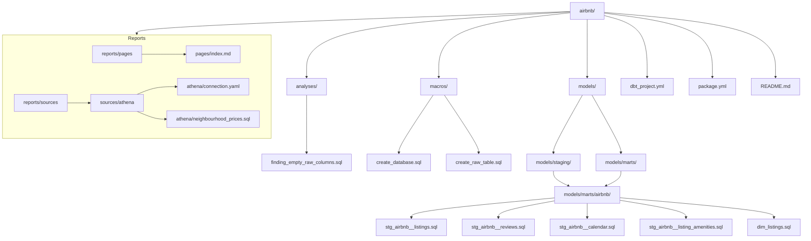

# Projeto Airbnb usando DataBuildTool (DBT) e deploy na Vercel 

O objetivo é analisar os preços de diárias dos imóveis listados no Airbnb, explorando a distribuição de preços, a correlação entre preço e nota de avaliação, e a distribuição por bairro.

## 📌 Sobre o Projeto

Este projeto consiste em uma **pipeline de dados end-to-end** e um **dashboard analítico interativo** para análise do mercado imobiliário do Airbnb na cidade de São Paulo.

O objetivo principal é extrair insights sobre preços, distribuição geográfica e avaliações dos imóveis, aplicando boas práticas de Engenharia de Dados: **Arquitetura Medalhão**, modelagem dimensional no **dbt**, e visualização de dados via **BI-as-code** com **Evidence.dev**.

### 🛠️ Diferenciais Técnicos da Arquitetura:
* **Arquitetura Medalhão (Bronze/Silver/Gold):** Organização clara entre dados brutos (S3), limpos/tipados e agregados prontos para análise (`lucca_gold`).
* **Modelagem e Qualidade com dbt:** Tratamento de tipos de dados, limpeza de caracteres especiais na coluna de preço e testes de integridade.
* **Leitura Eficiente com DuckDB Local:** O Evidence consulta a camada Gold no Athena e gera um cache local em DuckDB (`npm run sources`), garantindo performance de milissegundos no dashboard e redução drástica de custos na AWS.
* **Deploy Estático (SSG):** Geração de páginas estáticas hospedadas na Vercel com suporte a componentes interativos (`BigValue`, `Hist`, `ScatterPlot`, `Dropdown`).

### 💻 Tech Stack

* **Armazenamento & Consulta:** AWS S3, AWS Glue Data Catalog, AWS Athena
* **Transformação & Modelagem:** dbt (`dbt-athena-community`), SQL
* **Camada de Analytics & BI:** Evidence.dev, DuckDB, Svelte
* **CI/CD & Deploy:** Vercel / Netlify

## 📊 Estrutura do Projeto


### O projeto segue a arquitetura de dados em camadas, com as seguintes etapas:
 ```mermaid
 flowchart LR
     %% Fontes de Origem
     subgraph Sources[" 📥 Fonte de Dados "]
         A["Inside Airbnb - SP<br/>(CSVs de Anúncios e Diárias)"]
     end
 
     %% Arquitetura Medalhão na AWS
     subgraph Medallion[" 🏅 Arquitetura Medalhão (AWS) "]
         Bronze["🥉 Bronze Layer (S3 Raw)<br/>Arquivos CSV/Parquet Brutos"]
         Silver["🥈 Silver Layer (dbt / Athena)<br/>Tratamento de Preços, Nulos e Tipagem"]
         Gold["🥇 Gold Layer (lucca_gold)<br/>dim_listings / fct_listings_daily/ neighbourhood_perfomance"]
     end
 
     %% Processamento Local do Evidence
     subgraph EvidenceEngine[" ⚡ Camada do Evidence.dev "]
         AthenaQueries["sources/athena/*.sql<br/>Queries Selecionadas e Filtradas"]
         DuckDB["Cache Local (DuckDB)<br/>npm run sources"]
     end
 
     %% Consumo & Hospedagem
     subgraph Destinations[" 📊 Consumo & Publicação "]
         Dashboard["Dashboard Interativo (index.md)<br/>BigValues, BarChart, Hist, ScatterPlot"]
         Deploy["Deploy Estático (SSG)<br/>Vercel / Netlify"]
     end
 
     %% Fluxo de Dados
     Sources -->|Ingestão S3| Bronze
     Bronze -->|Limpeza & Regex de Cifrão| Silver
     Silver -->|Modelagem Dimensional| Gold
     Gold -->|Execução de Queries| AthenaQueries
     AthenaQueries -->|Download mínimo de colunas| DuckDB
     DuckDB -->|Alimenta Gráficos Localmente| Dashboard
     Dashboard -->|npm run build| Deploy
 
     %% Estilização das Camadas
     style Bronze fill:#cd7f32,stroke:#663300,stroke-width:2px,color:#fff
     style Silver fill:#c0c0c0,stroke:#4a4a4a,stroke-width:2px,color:#000
     style Gold fill:#ffd700,stroke:#8b6508,stroke-width:2px,color:#000
     style DuckDB fill:#fff7d6,stroke:#d9a700,stroke-width:2px,color:#000
     style Dashboard fill:#e6f0ff,stroke:#2563eb,stroke-width:2px,color:#000
     style Deploy fill:#111827,stroke:#374151,stroke-width:2px,color:#fff
     
 ```
## Quickstart

### Pré-requisitos

- Node.js: v18+
- Python: v3.9+
- AWS CLI: instalado e configurado
- dbt: com o adaptador dbt-athena-community

### Autenticação AWS

Garanta que você tenha as credenciais da AWS configuradas corretamente. Você pode configurar usando o comando:

```bash
aws configure
```

### Transformação de Dados com dbt-athena-community

```bash
# Criar e ativar ambiente virtual Python
python3 -m venv .venv
source .venv/bin/activate

# Instalar dbt e o conector do Athena
pip install dbt-athena-community

# Instalar pacotes do dbt e executar os modelos na AWS
dbt deps
dbt run
```

### Servidor Local do Dashboard (Evidence.dev)

Com os dados prontos no Athena, navegue até a pasta de relatórios para extrair os dados resumidos e subir o ambiente de desenvolvimento local:
``` bash
# Entrar na pasta do Evidence
cd ./reports

# Instalar dependências do Node
npm install

# Sincronizar as fontes do Athena para o DuckDB local
npm run sources

# Iniciar o servidor de desenvolvimento
npm run dev
```
Acesse `http://localhost:3000` no seu navegador para visualizar o dashboard.

### 🛠️ Teste de Build & Deploy na Vercel
Para garantir que a compilação SSG (Static Site Generation) não quebrará na nuvem:

```bash
npm run build
npm run preview
```
## 📜 Licença

Este projeto está sob a licença **MIT**. Veja o arquivo [LICENSE](LICENSE) para mais detalhes.
